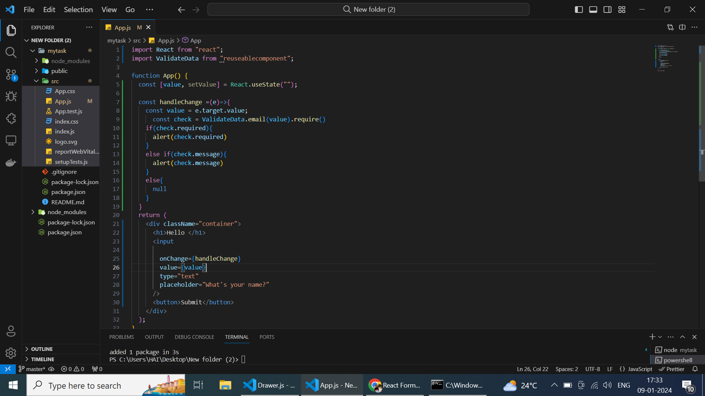
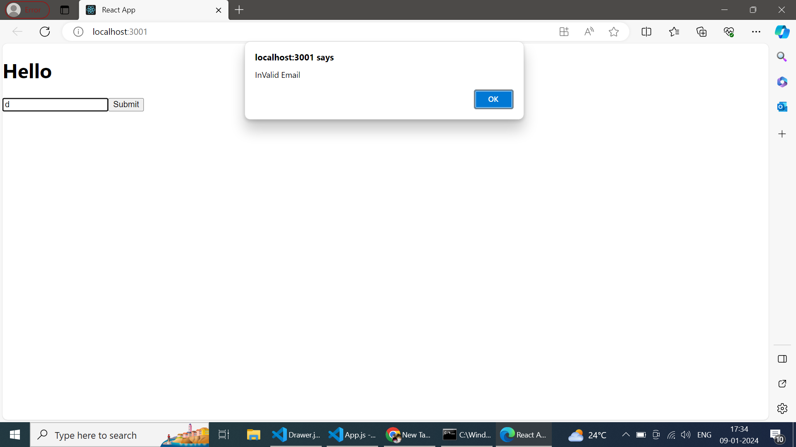

## Error Handler for Your Project
This npm package provides robust error handling capabilities for your project, allowing you to easily manage and validate various types of data.
 ## Installation 
 To install the package, use the following command :
 ````
npm install react-onchange-validation
````
 ````
yarn add react-onchange-validation
````
## Description

Import the  "ValidateData" object from 'react-onchange-validation' in your project
````
import  ValidateData from 'react-onchange-validation';
```` 
 ## Usage
 The ValidateData object is a collection of validation functions for different types of data. Each
function takes a value `v` as input and returns an object with a `message` property indicating the
validation result. 
/* In your handlechange function pass your target value and check for the type(i.e...emailID validation ,password validatation,Mobile Number Validatation,etc...) */

## Example

````
const handleChange =(e)=>{
        const value = e.target.value
    const  check = ValidateData.email(value).require()
      if (check.requried) {
      setErrorMsg(check.requried);
    } else if (check.message) {
      setErrorMsg(check.message);
    }
}

````
<!--  -->


 <!-- ## Message   -->
<!-- 
 Regex pattern used 
   ^[^\s$&*!#^@]+@[^\s@]+\.([^\s@]{2,3})+$
Message key will throw an error  if  there is an Regex Error in the entered EmailID. -->
<!--  -->


## Demo


 [Demo](https://codesandbox.io/p/sandbox/react-forms-forked-w3yctm?file=%2Fsrc%2Fcomponents%2FApp.jsx%3A15%2C33).

## Message
| Property | Definition    |                
| :---:   | :---: | 
| Requried | This Function throws the error if there is an Empty Field. |
| UserNameValidation | This function alidates name fields, ensuring that the first character is not a whitespace and validate special character. (example:ValidateData.usernameCheck(e.target.value).nameCheck())    |  
| emailValidation |This function validates a valid email using regex. (example:ValidateData.email(value).require()) | 
| numberValidation |This function checks a number field for minimum and maximum length. (example:ValidateData.mobileNumberCheck(e.target.value).numberRegexCheck().numberLimitCheck()) |  
| passwordValidation | This function validates strong passwords, ensuring there are no whitespace characters, and checks for both minimum and maximum password lengths. Additionally, it uses regex to verify the strength of the password. (example: ValidateData.password(value).passwordRegex().passwordLimit())|   
| confirmPasswordValidation | This function checks whether the new password and the confirm password values are the same.  (example:ValidateData.cpasswordCheck(value1,value2).comparingPassword())  | 
| value | The parameter type for this function is now set to 'any' for the value  (example:ValidateData.password(value))  |  
| value1,value2 | Two values are present: value1 represents the new password, and value2 represents the confirm password.(example:ValidateData.cpasswordCheck(value1,value2).comparingPassword()) |


## Regex
| Regex | Definition    | 
| :---:   | :---: | 
|name field  | This regex validates the presence of special characters in a name field.  (example: /^[A-Za-z' \-.]+$/ ) | 
| email pattern | This regex validates the correct email pattern. (example: /^(([^<>()[]\.,;:\s@"]+(.[^<>()[]\.,;:\s@"]+)* | 
| Specialcharacter| This regex checks for a strong password in password fields.(example:    /^(?=[^a-z]*[a-z])(?=[^A-Z]*[A-Z])(?=\D*\d)(?=[^@$!%*#?&]*[@$!%*#?&])[A-Za-z\d@$!%*#?&]*$/) |